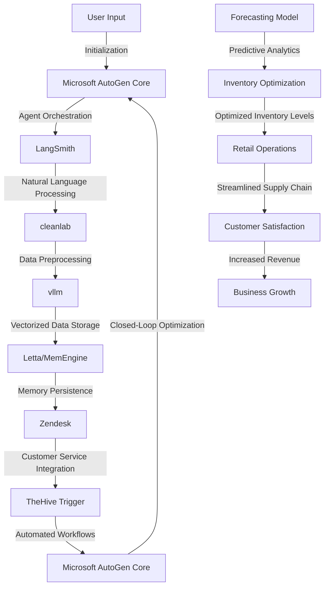

# Autonomous Retail Forecasting and Inventory Optimization Engine
> "Predictive Synergies for a Frictionless Retail Ecosystem"

## 🏗️ Technical Architecture & Multi-Agent Flow

This technical architecture diagram illustrates the complex interactions between the various components of the Autonomous Retail Forecasting and Inventory Optimization Engine. The engine leverages Microsoft AutoGen Core for agent orchestration, LangSmith for natural language processing, cleanlab for data preprocessing, vllm for vectorized data storage, Letta/MemEngine for memory persistence, Zendesk for customer service integration, and TheHive Trigger for automated workflows.

## 🔍 The Vertical Bottleneck: Predictive Inventory Management
The retail industry, particularly in the motor vehicles sector, faces a significant challenge in predicting inventory levels and optimizing supply chain operations. The inability to accurately forecast demand and adjust inventory accordingly can result in stockouts, overstocking, and lost sales. This bottleneck is further exacerbated by the complexity of modern retail operations, which involve multiple stakeholders, disparate data sources, and fragmented systems. The high-stakes nature of this problem demands a sophisticated solution that can navigate the intricacies of retail operations and provide actionable insights for informed decision-making.

The technical friction in predictive inventory management arises from the need to integrate multiple data sources, including historical sales data, seasonal trends, and real-time market analytics. The lack of standardized data formats and the presence of noise in the data further complicate the problem. Moreover, the use of traditional forecasting methods, such as ARIMA and exponential smoothing, often falls short in capturing the nuances of modern retail operations. The consequence of these limitations is a significant loss of revenue and a compromised customer experience.

The mathematical underpinnings of predictive inventory management involve the use of advanced statistical models, such as machine learning and deep learning algorithms. These models require large amounts of high-quality data to produce accurate forecasts. However, the collection and processing of such data are often hindered by the lack of standardization and the presence of noise. Furthermore, the interpretation of the results and the translation of the insights into actionable recommendations pose significant challenges.

## 💡 The Solution: Autonomous Retail Forecasting and Inventory Optimization Engine
The Autonomous Retail Forecasting and Inventory Optimization Engine addresses the predictive inventory management bottleneck by leveraging a combination of advanced technologies, including Microsoft AutoGen Core, LangSmith, cleanlab, vllm, Zendesk, and TheHive Trigger. The engine uses Microsoft AutoGen Core for agent orchestration, which enables the integration of multiple data sources and the coordination of complex workflows. LangSmith provides natural language processing capabilities, allowing the engine to extract insights from unstructured data sources, such as customer feedback and social media posts.

The engine's predictive analytics capabilities are powered by cleanlab, which provides advanced data preprocessing and machine learning algorithms. The use of vllm enables the engine to store and manage large amounts of vectorized data, facilitating the application of deep learning models. Letta/MemEngine provides memory persistence, ensuring that the engine can retain knowledge and adapt to changing market conditions over time. Zendesk integrates customer service capabilities, enabling the engine to provide personalized recommendations and support to customers. TheHive Trigger automates workflows, streamlining the supply chain and optimizing inventory levels.

## 🧩 Agentic Stack Deep-Dive
The Autonomous Retail Forecasting and Inventory Optimization Engine's agentic stack is designed to provide a flexible and scalable architecture for predictive inventory management. Microsoft AutoGen Core serves as the foundation of the stack, providing agent orchestration and workflow coordination. LangSmith and cleanlab provide natural language processing and machine learning capabilities, respectively. vllm and Letta/MemEngine enable the engine to store and manage large amounts of data, while Zendesk and TheHive Trigger provide customer service integration and automated workflows.

The integration of these components is facilitated by a set of APIs and data formats that enable seamless communication and data exchange. The use of standardized data formats, such as JSON and CSV, ensures that the engine can ingest and process data from multiple sources. The engine's architecture is designed to be modular, allowing for the easy addition or removal of components as needed.

## ✨ Capabilities & Features
* **Predictive Analytics**: The engine provides advanced predictive analytics capabilities, including machine learning and deep learning algorithms, to forecast demand and optimize inventory levels.
* **Natural Language Processing**: The engine uses natural language processing to extract insights from unstructured data sources, such as customer feedback and social media posts.
* **Automated Workflows**: The engine automates workflows, streamlining the supply chain and optimizing inventory levels.
* **Customer Service Integration**: The engine provides customer service integration, enabling personalized recommendations and support to customers.
* **Memory Persistence**: The engine retains knowledge and adapts to changing market conditions over time, ensuring that the predictions and recommendations remain accurate and relevant.
* **Scalability**: The engine is designed to scale with the needs of the business, handling large amounts of data and complex workflows with ease.
* **Flexibility**: The engine's modular architecture allows for the easy addition or removal of components, enabling the business to adapt to changing market conditions and customer needs.
* **Security**: The engine provides advanced security features, including encryption and access controls, to protect sensitive data and prevent unauthorized access.
* **User Interface**: The engine provides an intuitive user interface, enabling users to easily navigate and interact with the system.
* **Reporting and Analytics**: The engine provides advanced reporting and analytics capabilities, enabling users to track key performance indicators and make data-driven decisions.

## 🛠️ Technical Implementation
The Autonomous Retail Forecasting and Inventory Optimization Engine is implemented using a combination of Python, Java, and C++ programming languages. The engine's architecture is designed to be modular, with each component providing a specific set of capabilities and features. The use of APIs and data formats enables seamless communication and data exchange between components.

The engine's predictive analytics capabilities are implemented using a combination of machine learning and deep learning algorithms, including TensorFlow and PyTorch. The natural language processing capabilities are implemented using LangSmith, which provides advanced text processing and sentiment analysis capabilities.

The engine's automated workflows are implemented using TheHive Trigger, which provides a flexible and scalable architecture for automating complex workflows. The customer service integration is implemented using Zendesk, which provides advanced customer service and support capabilities.

## 📊 Business Impact & ROI
The Autonomous Retail Forecasting and Inventory Optimization Engine has the potential to significantly impact the retail industry, particularly in the motor vehicles sector. By providing advanced predictive analytics and automated workflows, the engine can help businesses optimize inventory levels, reduce stockouts and overstocking, and improve customer satisfaction.

The engine's ability to provide personalized recommendations and support to customers can also help businesses increase revenue and improve customer loyalty. The use of natural language processing and machine learning algorithms can help businesses extract insights from unstructured data sources, enabling them to make data-driven decisions and stay ahead of the competition.

The return on investment (ROI) for the Autonomous Retail Forecasting and Inventory Optimization Engine can be significant, with potential benefits including:

* **Increased Revenue**: The engine's ability to provide personalized recommendations and support to customers can help businesses increase revenue and improve customer loyalty.
* **Reduced Costs**: The engine's ability to optimize inventory levels and reduce stockouts and overstocking can help businesses reduce costs and improve efficiency.
* **Improved Customer Satisfaction**: The engine's ability to provide personalized recommendations and support to customers can help businesses improve customer satisfaction and loyalty.

## 🚀 Getting Started
```bash
git clone https://github.com/arvind-sundararajan/retail-forecasting-inventory-optimizatio.git
cd retail-forecasting-inventory-optimizatio
pip install -r requirements.txt
python src/main.py
```

## 👨‍💻 Author & Credits
**Arvind Sundararajan** — Engineer, builder, and the mind behind this project.
🌐 [LinkedIn](https://www.linkedin.com/in/arvind-sundara-rajan/) | Chennai, India

---
### 🙏 Acknowledgements
- The open-source community
- The Retail — Motor Vehicles practitioners who inspired this design